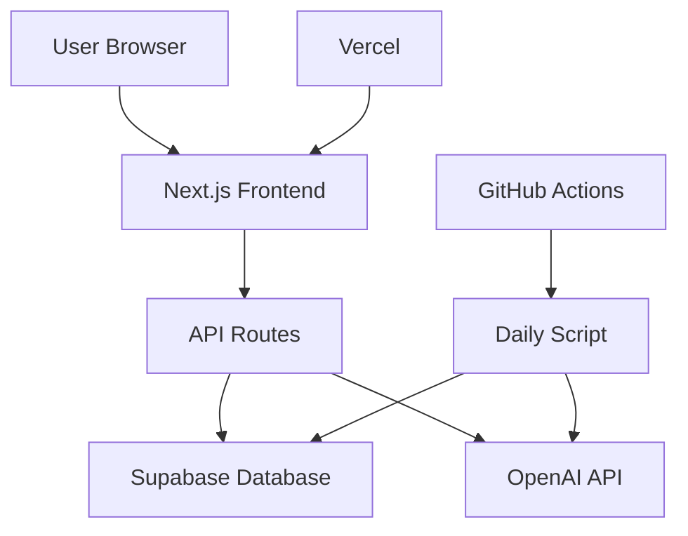

# Design Document

## Overview

The AI News Website is a Next.js-based web application that displays 3 daily AI news stories with a retro terminal interface. The system follows a similar architecture to the code-history-day-web project but is adapted for AI news content. The application uses Supabase for data storage, OpenAI for content generation, and Vercel for deployment.

## Architecture

### Technology Stack

**Frontend:**
- Next.js 15.2.4 (App Router)
- TypeScript 5.x
- Tailwind CSS 3.4.17
- React 18
- Lucide React (icons)
- next-themes (theme support)

**Backend & Database:**
- Supabase (PostgreSQL database)
- Next.js API Routes
- OpenAI API (content generation)

**Deployment:**
- Vercel (hosting)
- GitHub Actions (automation)

### System Architecture



## Components and Interfaces

### Database Schema

**ai_news table:**
```sql
CREATE TABLE ai_news (
  id BIGSERIAL PRIMARY KEY,
  day INTEGER NOT NULL,
  month INTEGER NOT NULL,
  year INTEGER NOT NULL,
  title TEXT NOT NULL,
  summary TEXT NOT NULL,
  source TEXT,
  display_date TEXT NOT NULL,
  position INTEGER NOT NULL CHECK (position IN (1, 2, 3)),
  created_at TIMESTAMP WITH TIME ZONE DEFAULT NOW(),
  updated_at TIMESTAMP WITH TIME ZONE DEFAULT NOW()
);

-- Unique constraint to ensure only 3 news per date
CREATE UNIQUE INDEX ai_news_date_position_unique 
ON ai_news (display_date, position);

-- Index for efficient date queries
CREATE INDEX ai_news_display_date_idx ON ai_news (display_date);
```

### API Endpoints

**GET /api/ai-news**
- Query parameters: `date` (optional, format: YYYY-MM-DD)
- Returns: Array of 3 news stories for the specified date
- Response format:
```typescript
{
  success: boolean;
  data: AiNews[] | null;
  error?: string;
}

interface AiNews {
  id: number;
  title: string;
  summary: string;
  source?: string;
  display_date: string;
  position: number;
  day: number;
  month: number;
  year: number;
}
```

### Core Components

**1. Terminal Interface Component**
- Handles typewriter animation effects
- Manages cursor blinking
- Responsive design for mobile/desktop
- Terminal-style command prompt simulation

**2. News Display Component**
- Renders the 3 daily news stories
- Handles loading states
- Manages error states when no news available
- Formats news content for terminal display

**3. Navigation Component**
- Date navigation (previous/next day)
- URL state management
- Date picker functionality

**4. Share Component**
- Social media sharing (X/Twitter)
- Pre-formatted tweet generation
- Character limit handling

### File Structure

```
ai-news-website/
├── app/
│   ├── api/
│   │   └── ai-news/
│   │       └── route.ts
│   ├── globals.css
│   ├── layout.tsx
│   └── page.tsx
├── components/
│   ├── ui/
│   │   ├── button.tsx
│   │   ├── card.tsx
│   │   └── [other shadcn components]
│   ├── terminal-interface.tsx
│   ├── news-display.tsx
│   ├── navigation.tsx
│   ├── share-button.tsx
│   └── theme-provider.tsx
├── lib/
│   ├── ai-news.ts
│   ├── browser-utils.ts
│   └── utils.ts
├── scripts/
│   ├── generate-daily-ai-news.js
│   └── README.md
├── public/
│   └── [static assets]
└── [config files]
```

## Data Models

### AiNews Interface
```typescript
interface AiNews {
  id: number;
  day: number;
  month: number;
  year: number;
  title: string;
  summary: string;
  source?: string;
  display_date: string;
  position: number; // 1, 2, or 3
  created_at?: string;
  updated_at?: string;
}
```

### API Response Types
```typescript
interface ApiResponse<T> {
  success: boolean;
  data: T | null;
  error?: string;
}

type AiNewsResponse = ApiResponse<AiNews[]>;
```

## Error Handling

### Client-Side Error Handling
- Loading states during API calls
- Graceful degradation when API fails
- User-friendly error messages
- Retry mechanisms for failed requests

### Server-Side Error Handling
- Database connection error handling
- OpenAI API error handling with retries
- Input validation and sanitization
- Proper HTTP status codes

### Error States
1. **No News Available**: Display message when no news exists for selected date
2. **Network Errors**: Show retry button and loading indicators
3. **Database Errors**: Graceful fallback with cached content if available
4. **Generation Errors**: Log errors and retry content generation

## Testing Strategy

### Unit Testing
- Component rendering tests
- API endpoint tests
- Utility function tests
- Database query tests

### Integration Testing
- End-to-end user flows
- API integration tests
- Database integration tests
- OpenAI API integration tests

### Manual Testing
- Cross-browser compatibility
- Mobile responsiveness
- Performance testing
- Accessibility testing

## Content Generation Strategy

### Daily News Generation Process
1. **Automated Trigger**: GitHub Actions runs daily at 9:00 UTC
2. **Content Generation**: OpenAI generates 3 AI news stories
3. **Content Validation**: Ensure stories are relevant and well-formatted
4. **Database Storage**: Store stories with proper positioning (1, 2, 3)
5. **Error Handling**: Retry on failures, log issues

### OpenAI Prompt Design
```
Generate 3 important AI news stories for [DATE]. Each story should be:
- Relevant to artificial intelligence, machine learning, or AI industry
- Realistic and educational
- 2-3 sentences long
- Include a compelling title

Format as JSON array with title and summary fields.
```

### Content Quality Assurance
- Validate JSON structure
- Check content length limits
- Ensure no duplicate content
- Verify relevance to AI topics

## Performance Considerations

### Frontend Optimization
- Next.js static generation where possible
- Image optimization
- Code splitting
- Lazy loading for non-critical components

### Backend Optimization
- Database indexing for date queries
- API response caching
- Connection pooling
- Query optimization

### Deployment Optimization
- Vercel edge functions
- CDN for static assets
- Environment-specific configurations
- Monitoring and analytics

## Security Considerations

### API Security
- Environment variable protection
- Rate limiting on API endpoints
- Input validation and sanitization
- CORS configuration

### Database Security
- Row Level Security (RLS) in Supabase
- Service key protection
- SQL injection prevention
- Data encryption at rest

### Content Security
- OpenAI API key protection
- Content validation before storage
- XSS prevention in content display
- Safe HTML rendering